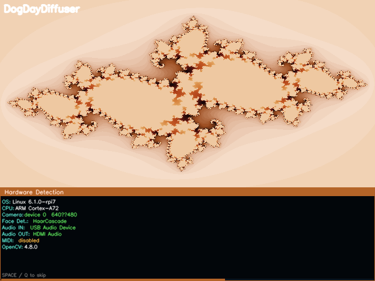

# DogDayDiffuser

A real-time visual effects engine for Raspberry Pi 3 (and desktop) that takes
webcam input, detects faces, and generates psychedelic fractal / kaleidoscope /
feedback visuals that react to face position and optionally to live audio.

This is **not** true diffusion/AI image generation — it is a lightweight,
performance-first effects pipeline that feels "AI-ish" while running on
constrained hardware.

---

## Splash screen

On startup the app shows a 10-second animated splash screen before entering the main effects loop.



- **Top 2/3 — animated fractal:** A Julia set rendered in a warm King Charles Cavalier colour palette (dark mahogany → ruby-red → chestnut → caramel tan → cream white), animated by palette cycling.
- **Bottom 1/3 — hardware console:** OS, CPU, camera, face detector, audio, MIDI and OpenCV version, revealed row-by-row with a countdown progress bar.
- Press **Space** to skip to the main loop or **Q / Esc** to quit.

---

## Features

- Animated startup splash screen with King Charles Cavalier fractal and hardware detection console
- Live webcam capture with configurable resolution
- Kaleidoscope / mirrored symmetry effect
- Zoom feedback / recursive trails
- Face-centred warp and swirl
- Fake-AI colour styling (posterise, glow, edge enhancement, channel shift)
- Face detection (OpenCV Haar cascade, with optional Intel NCS2 / OpenVINO backend)
- Optional audio reactivity (amplitude, bass/mid/treble energy, beat pulse)
- Keyboard shortcuts and command-line flags
- Graceful degradation when webcam, audio, or OpenVINO are unavailable

---

## Project structure

```
DogDayDiffuser/
├── main.py              # App entry point, main loop
├── splash.py            # Animated startup splash screen
├── camera.py            # Webcam capture abstraction
├── face_detection.py    # Face detector interface (OpenCV + OpenVINO)
├── audio_reactivity.py  # Audio capture and FFT-based feature extraction
├── renderer.py          # Compositing and final display output
├── config.py            # Defaults and CLI argument parsing
├── utils.py             # Timing, scaling, and helper utilities
├── effects/
│   ├── __init__.py
│   ├── base.py          # Abstract base effect class
│   ├── kaleidoscope.py  # Mirror/symmetry effect
│   ├── feedback.py      # Zoom feedback / recursive trails
│   ├── warp.py          # Face-centred warp / swirl
│   └── color_fx.py      # Posterise, glow, edge, channel-shift
├── requirements.txt
└── README.md
```

---

## Requirements

- Python 3.8+
- OpenCV (`opencv-python`)
- NumPy

Optional:
- `sounddevice` or `PyAudio` — for live audio reactivity
- `openvino` — for Intel Neural Compute Stick 2 (NCS2) face detection

---

## Installation

### Desktop (Linux / macOS / Windows)

```bash
# Clone the repo
git clone https://github.com/julesdg6/DogDayDiffuser.git
cd DogDayDiffuser

# Create a virtual environment (recommended)
python3 -m venv venv
source venv/bin/activate   # Windows: venv\Scripts\activate

# Install dependencies
pip install -r requirements.txt
```

### Raspberry Pi 3

```bash
# Install system packages
sudo apt-get update
sudo apt-get install -y python3-pip python3-venv libopencv-dev

# Create venv and install
python3 -m venv venv
source venv/bin/activate
pip install -r requirements.txt
```

#### Optional: audio reactivity on Pi

```bash
sudo apt-get install -y portaudio19-dev
pip install sounddevice
# or
pip install PyAudio
```

#### Optional: Intel NCS2 / OpenVINO

Follow the [OpenVINO installation guide](https://docs.openvino.ai/latest/openvino_docs_install_guides_install_openvino_raspbianos.html) for Raspberry Pi, then:

```bash
pip install openvino
```

---

## Usage

```bash
python main.py [options]
```

### Common options

| Flag | Default | Description |
|------|---------|-------------|
| `--camera` | `0` | Camera device index |
| `--width` | `320` | Internal processing width |
| `--height` | `240` | Internal processing height |
| `--fullscreen` | off | Start in fullscreen mode |
| `--effect` | `kaleidoscope` | Starting effect (`kaleidoscope`, `feedback`, `warp`, `color`) |
| `--no-face` | off | Disable face detection |
| `--audio` | off | Enable audio reactivity |
| `--audio-device` | system default | Audio input device index |
| `--use-openvino` | off | Use OpenVINO/NCS2 for face detection |
| `--detection-interval` | `5` | Run face detection every N frames |
| `--config` | none | Path to JSON config file |

### Examples

```bash
# Basic launch
python main.py

# Fullscreen with audio
python main.py --fullscreen --audio

# Higher resolution feedback effect
python main.py --width 424 --height 240 --effect feedback

# Use Intel NCS2
python main.py --use-openvino

# Load settings from JSON
python main.py --config my_settings.json
```

---

## Keyboard shortcuts

| Key | Action |
|-----|--------|
| `q` / `Esc` | Quit (also skips splash immediately) |
| `space` | Skip splash screen / cycle to next effect |
| `f` | Toggle fullscreen |
| `1` | Kaleidoscope effect |
| `2` | Feedback trails |
| `3` | Face warp |
| `4` | Colour FX |
| `5` | Geiss mode |
| `6` | MilkDrop mode |
| `e` | Exit visual mode (back to effects) |
| `r` | Reset current mode |
| `[` / `]` | Previous / next MilkDrop preset |
| `a` | Toggle audio reactivity |
| `d` | Toggle face detection |
| `+` / `-` | Increase / decrease trail strength |
| `w` / `s` | Increase / decrease warp amount |

---

## JSON config file

```json
{
  "camera": 0,
  "width": 320,
  "height": 240,
  "fullscreen": false,
  "effect": "kaleidoscope",
  "no_face": false,
  "audio": false,
  "audio_device": null,
  "use_openvino": false,
  "detection_interval": 5
}
```

---

## Performance tips

- Keep `--width` at 320 or lower on Raspberry Pi 3
- Disable audio if not needed: omit `--audio`
- Disable face detection to save CPU: `--no-face`
- Use `--use-openvino` with NCS2 for faster face detection
- The feedback and warp effects are slightly heavier; kaleidoscope is cheapest

---

## Architecture notes

The pipeline runs in a single main loop:

```
Camera.read() → downsample → FaceDetector.detect() (every N frames)
    → AudioReactor.get_features() → Effect.apply() → Renderer.show()
```

Each stage is isolated so any component can be replaced or disabled without
affecting the others.

---

## Roadmap

- [ ] Phase 1: webcam + kaleidoscope ✅
- [ ] Phase 2: face detection + parameter mapping ✅
- [ ] Phase 3: feedback trails + warp ✅
- [ ] Phase 4: audio reactivity ✅
- [ ] Phase 5: animated splash screen ✅
- [ ] Phase 6: Raspberry Pi optimisation and tuning
- [ ] Phase 7: recording / output mode
- [ ] Phase 8: facial landmarks for precise warp targeting

---

## Licence

MIT
